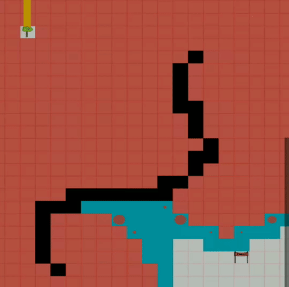

# Path Finder

An app that can help you visualize your favourite path finding algorithms with decent UI and many cutomizations

## Algorithms for path finding

### Dijkstra

Dijkstra's algorithm is an algorithm for finding the shortest paths between nodes in a graph, which may represent, for example, road networks.

### A\*

A\* is a graph traversal and path search algorithm, which is often used in many fields of computer science due to its completeness, optimality, and optimal efficiency.

### Bidirectional dijkstra

Bidirectional search replaces single search graph(which is likely to grow exponentially) with two smaller sub graphs – one starting from initial vertex and other starting from goal vertex. The search terminates when two graphs intersect

## Algorithms for wall generation

### Recursive Backtrack

This algorithm, also known as the "recursive backtracker" algorithm, is a randomized version of the depth-first search algorithm. ... The computer removes the wall between the two cells and marks the new cell as visited, and adds it to the stack to facilitate backtracking

### Recursive division

The algorithm really is as simple as described. First, we’ll “blank out” the grid by linking every cell to its neighbors (effectively removing all interior walls), and then recursively split the grid in half by adding walls back in.

### Random

As the name suggests this algo has a random selection of where to put walls on the grid where a double is generated between 0 to 1 ,if that number is less than .3 wall if build.

